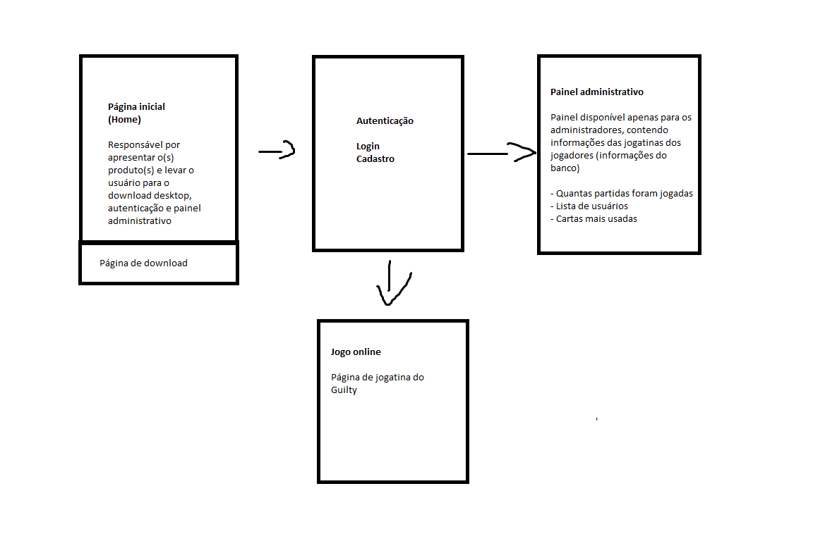

# Projeto integrador Guilty

Repositório do projeto integrador web, UC 15, do jogo Guilty.

## Como clonar o projeto
1. Abrir o CMD ou o Git Bash Here
2. Digitar: `git clone https://github.com/rhuu4n/projeto_web` 
3. Entrar na pasta: `cd projeto_web`
4. Baixar o Node: `npm install`
5. Pronto :)

## Páginas

- _Página inicial_ (home): Responsável por apresentar o produto e levar o usuário para o download dekstop, autenticação e painel administrador.
- _Autenticação_: Login e cadastro
- _Painel Administrativo_: Painel disponível apenas para administradores, contendo informações das jogatinas dos jogadores (informações do banco), exemplo: quantas partidas foram jogadas, lista de usuários, etc
- _Jogo online_: Página de jogatina do Guilty

## Atribuição de tarefas

- _Danilo_: Painel administrativo
- _Victor_: Autenticação / Download
- _Hugo_: Página inicial
- _Rhuan_: Jogo online 
- _Erik_: Jogo online

